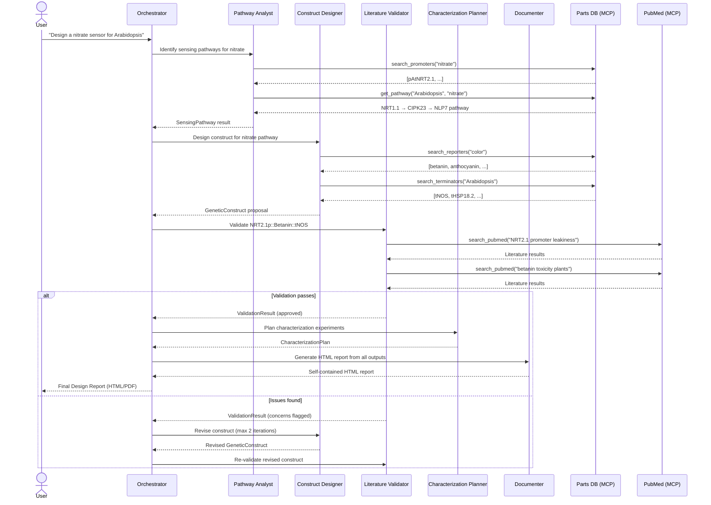

# Architecture

## Workflow Sequence



## Agent Responsibilities

### Orchestrator
- Receives user query and parses target signal + organism
- Routes tasks to specialist agents in sequence
- Manages revision loop (max 2 iterations) when Literature Validator flags issues
- Compiles outputs from all agents into final design report
- Implemented as AutoGen GroupChatManager with custom speaker selection

### Pathway Analyst
- Queries the Parts Database for signal-responsive promoters
- Maps known signal transduction pathways (receptor → TFs → promoter activation)
- Returns `SensingPathway` model with confidence score
- Domain knowledge: plant molecular biology, nitrogen/phosphorus/drought/metal stress pathways

### Construct Designer
- Selects optimal parts combination: promoter + reporter + terminator + regulatory elements
- Considers: construct size, codon optimization, detection modality (field vs. lab)
- Returns one or more `GeneticConstruct` proposals ranked by feasibility

### Literature Validator
- Searches PubMed and RAG index for evidence supporting/contradicting the proposed construct
- Flags known failure modes: promoter leakiness, reporter toxicity, pathway crosstalk
- Returns `ValidationResult` with citations (PMIDs) for all claims

### Characterization Planner
- Designs dose-response experiments with appropriate concentration ranges
- Specifies positive/negative controls and specificity tests
- Proposes measurement protocols and statistical design
- Returns `CharacterizationPlan` with timeline estimate

### Documenter
- Takes all workflow outputs (pathway, construct, validation, characterization plan) and generates a polished report
- Produces self-contained HTML with inline SVG construct maps, color-coded component cards, styled tables, and callout boxes
- Visual style: clean cards with subtle shadows, color-coded genetic parts (green=promoter, purple=CDS, gray=terminator, orange=regulatory)
- No external dependencies — single HTML file with embedded CSS
- Targets publication-quality aesthetics (Nature Methods / Plant Cell supplementary style)

## Post-Processing Pipeline

After the agent pipeline completes, three deterministic verification stages run without any LLM calls:

1. **PMID Validation** (`report_qc.py`) — Extracts all PMIDs from the HTML, cross-references against the verified registry (populated during agent tool calls), and flags unverified citations with a visual badge.

2. **Design Verification** (`design_verifier.py`) — Checks components against the curated parts catalog, validates promoter-signal associations against the pathways database, verifies structural completeness (SVG, key sections), and checks for gene accession numbers.

3. **Cross-Reactivity Analysis** (`design_verifier.py`) — Identifies the primary promoter, looks up its known cis-elements from a static knowledge base (30+ promoters, 10 shared element types), and detects overlap with non-target signal pathways. Generates a Specificity Report Card panel injected into the HTML with severity-graded hits and mitigation recommendations.

```
Agent HTML → PMID QC → Design Verification → Cross-Reactivity → Specificity Report → Final HTML
```

## Shared State

```python
@dataclass
class WorkflowState:
    user_query: str
    target_signal: str
    target_organism: str
    pathways: list[SensingPathway]
    constructs: list[GeneticConstruct]
    validation_results: list[ValidationResult]
    characterization_plan: CharacterizationPlan | None
    report_html: str | None  # generated HTML report from Documenter
    current_step: str  # "start" | "pathway" | "design" | "validate" | "characterize" | "document" | "done"
    revision_count: int  # tracks iterations, capped at max_revisions
```

## MCP Server Tool Schemas

### Parts Database Server
| Tool | Input | Output |
|------|-------|--------|
| `search_promoters` | `signal: str, organism?: str` | List of matching promoter parts |
| `search_reporters` | `output_type?: str` | List of reporter gene parts |
| `search_terminators` | `organism?: str` | List of terminator parts |
| `get_part_details` | `part_id: str` | Full part record with references |

### PubMed Server
| Tool | Input | Output |
|------|-------|--------|
| `search_pubmed` | `query: str, max_results?: int` | List of paper summaries |
| `fetch_abstract` | `pmid: str` | Abstract text + metadata |
| `fetch_related` | `pmid: str, max_results?: int` | Related paper summaries |

### Sequence Server *(stretch goal)*
| Tool | Input | Output |
|------|-------|--------|
| `reverse_complement` | `sequence: str` | Reverse complement DNA string |
| `check_restriction_sites` | `sequence: str` | List of restriction enzyme cut sites |
| `assemble_construct` | `parts: list[str]` | Assembled sequence with junctions |
