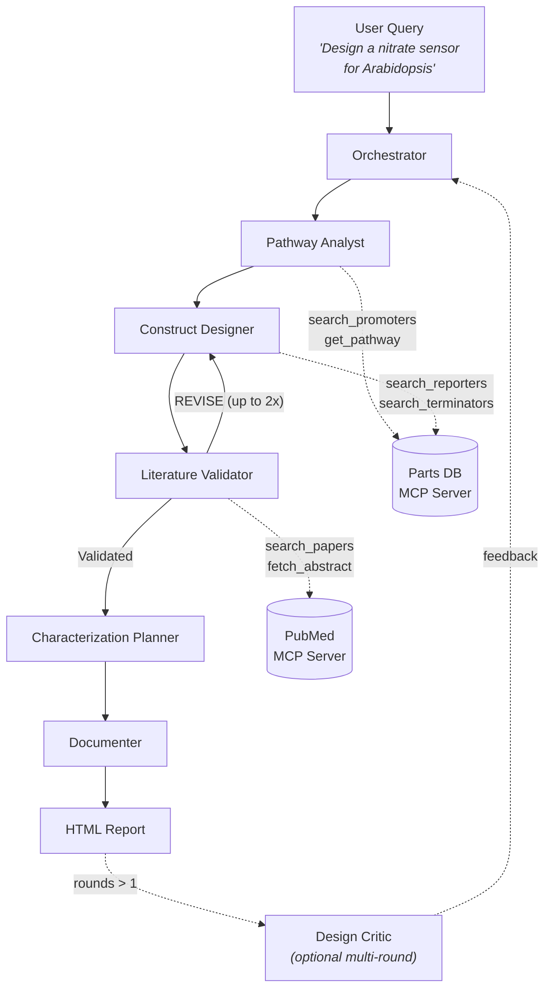

# BioSensor-Architect

A multi-agent AI system for designing genetic constructs for living plant biosensors. Given a target environmental signal (e.g., nitrate deficiency, drought stress, heavy metal contamination), BioSensor-Architect coordinates six specialist agents to propose complete genetic construct designs — from promoter selection through characterization planning — and outputs a polished, self-contained HTML report with literature-validated citations.

Built with [AutoGen](https://github.com/microsoft/autogen) (Microsoft) and [Model Context Protocol](https://modelcontextprotocol.io/). Developed with domain expertise from the [Stroock Lab](https://www.stroocklab.com/) (Cornell University) and 
the NSF STC [CROPPS](https://cropps.cornell.edu), where ongoing research focuses on engineered plant biosensors.

## Architecture



## Agents

| Agent | Role | Tools |
|-------|------|-------|
| **Orchestrator** | Parses user query into a structured design brief | — |
| **Pathway Analyst** | Identifies biological sensing pathways — receptors, transduction chains, candidate promoters | `search_promoters`, `get_pathway` |
| **Construct Designer** | Proposes genetic constructs — promoter, reporter, terminator, regulatory elements | `search_promoters`, `search_reporters`, `search_terminators` |
| **Literature Validator** | Cross-references designs against PubMed literature; flags known issues; triggers revision loop if needed | `search_papers`, `fetch_abstract` |
| **Characterization Planner** | Designs experimental plans — dose-response curves, specificity controls, timelines | — |
| **Documenter** | Generates a self-contained HTML report with construct maps, component cards, and styled tables | — |

Orchestration uses AutoGen's `SelectorGroupChat` with a custom deterministic `selector_func` that enforces the pipeline order and supports a LiteratureValidator → ConstructDesigner revision loop (up to 2 revisions).

## Features

- **End-to-end design pipeline** — from natural language query to complete HTML report
- **Literature-grounded citations** — PubMed PMID lookup with post-processing validation (broken links flagged automatically)
- **Design verification** — post-processing checks components against curated parts DB, flags missing accessions and promoter-signal mismatches
- **Cross-reactivity analysis** — deterministic cis-element overlap detection across 30+ promoters and 10 shared regulatory elements, with severity-graded specificity report card injected into HTML output
- **Genetic circuit guidance** — when cross-reactivity is severe, agents suggest AND NOT gates (CRISPRi), OR gates, or orthogonal repressors to mitigate off-target activation
- **Revision loop** — LiteratureValidator can send designs back to ConstructDesigner for improvement
- **Multi-round critique** — optional design rounds where a standalone Critic LLM scores the output and feeds back improvements (`--rounds 2`)
- **Paper ingestion** — expand the parts database from published papers via PMID or DOI (`bsa ingest`)
- **Curated domain data** — 44 plant genetic parts (19 promoters, 9 reporters, 4 terminators, 4 regulatory elements) and 17 signal transduction pathways covering 15+ environmental signals
- **Dual LLM support** — OpenAI (GPT-4o) and Anthropic (Claude Sonnet/Opus) with automatic model detection
- **MCP servers** — standalone Parts DB and PubMed servers for use with any MCP-compatible client

## Quick Start

```bash
# Clone and install
git clone https://github.com/jacobbelding/BioSensor-Architect.git
cd BioSensor-Architect
python -m venv .venv
source .venv/bin/activate
pip install -e ".[dev]"

# Configure
cp .env.example .env
# Edit .env with your OpenAI or Anthropic API key

# Run a design
bsa run "design a nitrate sensor for Arabidopsis"

# Multi-round critique (2 rounds, ~2x token cost)
bsa run "design a drought stress sensor for Arabidopsis" --rounds 2

# Ingest a paper to expand the parts database
bsa ingest "PMID:11050181"

# Run tests
pytest
```

## CLI Commands

| Command | Description |
|---------|-------------|
| `bsa run <query>` | Run the full design workflow. Options: `--output`, `--model`, `--rounds`, `--verbose` |
| `bsa ingest <ids>` | Ingest papers by PMID/DOI into the parts catalog. Options: `--yes`, `--model` |
| `bsa index-papers <path>` | Index papers into RAG database *(not yet implemented)* |
| `bsa serve` | Start MCP servers *(not yet implemented)* |

## Example Output

See [`examples/drought_sensor_arabidopsis.html`](examples/drought_sensor_arabidopsis.html) for a complete example — a drought stress sensor for *Arabidopsis thaliana* generated with Claude Sonnet over 2 design rounds. Includes SVG construct map, component cards with gene accessions, literature-validated citations (PubMed PMIDs), dose-response characterization plan, specificity controls, and a cross-reactivity report card with severity-graded cis-element analysis.

Also see [`examples/potassium_sensor_arabidopsis.html`](examples/potassium_sensor_arabidopsis.html) for a potassium deficiency sensor design.

## Project Structure

```
BioSensor-Architect/
├── src/biosensor_architect/
│   ├── agents/              # Agent definitions (system prompts + tool bindings)
│   │   ├── base.py          # Agent factory (AutoGen AssistantAgent + model client)
│   │   ├── orchestrator.py
│   │   ├── pathway_analyst.py
│   │   ├── construct_designer.py
│   │   ├── literature_validator.py
│   │   ├── characterization_planner.py
│   │   └── documenter.py
│   ├── orchestration/       # Pipeline coordination + post-processing
│   │   ├── workflow.py      # SelectorGroupChat wiring + pipeline routing
│   │   ├── critic.py        # Multi-round design critique (standalone LLM call)
│   │   ├── report_qc.py     # Post-processing PMID validation
│   │   └── design_verifier.py # Component verification + cross-reactivity analysis
│   ├── tools/               # Agent tool functions
│   │   ├── pathway_db.py    # Parts catalog + pathway queries
│   │   ├── pubmed_search.py # NCBI E-utilities (esearch, esummary, efetch)
│   │   ├── paper_ingest.py  # PMID/DOI → LLM extraction → catalog append
│   │   └── sequence_utils.py
│   ├── rag/                 # ChromaDB literature indexing (scaffolded)
│   ├── models.py            # Pydantic data models
│   ├── config.py            # Environment configuration
│   └── cli.py               # Click CLI with Rich output
├── mcp_servers/
│   ├── parts_db_server/     # Parts database MCP server (standalone)
│   │   └── data/            # 44 parts (parts_catalog.json) + 17 pathways (pathways.json)
│   └── pubmed_server/       # PubMed search MCP server (standalone)
├── data/                    # Supporting data and RAG index
│   ├── example_constructs/  # Reference JSON construct models
│   └── literature_index/    # ChromaDB vector store (gitignored, populated via bsa index-papers)
├── scripts/                 # Batch data ingestion scripts
├── examples/                # Example HTML output
├── output/                  # Generated reports (gitignored)
├── prompts/                 # LLM prompts for data expansion (Gemini Deep Research)
└── tests/                   # 78 tests (pytest + pytest-asyncio)
```

## Tech Stack

| Component | Technology |
|-----------|------------|
| Agent orchestration | [AutoGen 0.7](https://github.com/microsoft/autogen) — `SelectorGroupChat` with custom selector |
| Tool protocol | [Model Context Protocol (MCP)](https://modelcontextprotocol.io/) — stdio transport |
| LLM backend | OpenAI GPT-4o / GPT-4o-mini, Anthropic Claude Sonnet/Opus (auto-detected) |
| Data models | [Pydantic v2](https://docs.pydantic.dev/) |
| Literature search | NCBI E-utilities, CrossRef API |
| CLI | [Click](https://click.palletsprojects.com/) + [Rich](https://github.com/Textualize/rich) |

## Configuration

Copy `.env.example` to `.env` and set your keys:

| Variable | Required | Description |
|----------|----------|-------------|
| `OPENAI_API_KEY` | Yes* | OpenAI API key |
| `ANTHROPIC_API_KEY` | Yes* | Anthropic API key (recommended: `claude-sonnet-4-20250514`) |
| `NCBI_API_KEY` | No | NCBI E-utilities key (improves rate limits 3→10 req/sec) |
| `DEFAULT_MODEL` | No | Default model (default: `gpt-4o`). Recommended: `claude-sonnet-4-20250514` for best quality. |
| `DESIGN_ROUNDS` | No | Number of critique rounds (default: `1` = single pass) |
| `CROSSREF_EMAIL` | No | Email for CrossRef polite pool (DOI resolution) |

\*At least one LLM API key is required.

## Roadmap

- [x] Project scaffolding and Pydantic data models
- [x] Parts database MCP server with 18 curated plant genetic parts
- [x] PubMed MCP server with NCBI E-utilities
- [x] All 6 agents implemented with tool bindings
- [x] SelectorGroupChat orchestration with revision loop
- [x] HTML report generation with PMID validation
- [x] Multi-round design critique
- [x] Paper ingestion CLI (`bsa ingest`)
- [x] Anthropic Claude model client support (auto-detects `claude-*` models)
- [x] Design verification against curated parts database
- [x] Cross-reactivity verifier with cis-element knowledge base (30+ promoters, 10 shared elements)
- [x] Specificity Report Card injected into HTML output (severity-graded, color-coded)
- [x] Expanded parts database (44 parts, 17 pathways via Gemini Deep Research curation)
- [x] Structured agent prompts with genetic circuit design guidance and few-shot examples
- [x] 78 passing tests
- [ ] RAG literature retrieval (ChromaDB — scaffolded)
- [ ] Sequence tools MCP server

## License

[MIT](LICENSE)
