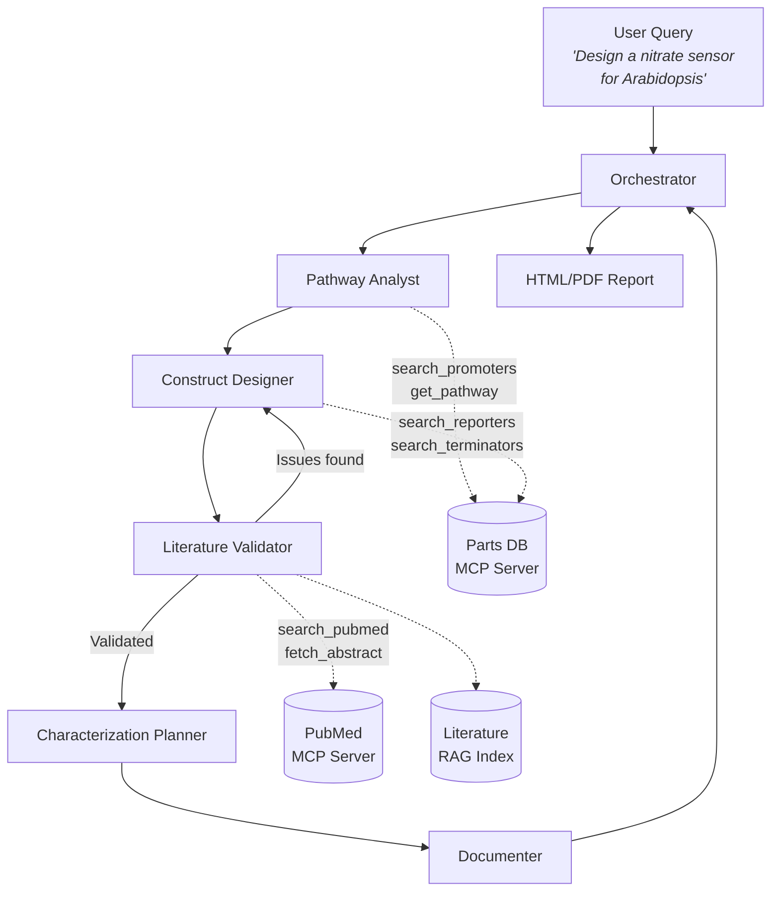

# BioSensor-Architect

A multi-agent AI system for designing genetic constructs for living sensor organisms. Given a target environmental signal (e.g., nitrate deficiency, drought stress, heavy metal contamination), BioSensor-Architect proposes complete genetic construct designs with promoter selection, reporter gene choice, literature validation, and experimental characterization plans.

## Architecture



## Agents

| Agent | Role |
|-------|------|
| **Orchestrator** | Manages workflow, routes information between agents, handles revision loops, compiles final report |
| **Pathway Analyst** | Identifies biological sensing pathways for the target signal — receptors, transduction chains, candidate promoters |
| **Construct Designer** | Proposes genetic constructs — promoter, reporter gene, terminator, regulatory elements, codon optimization |
| **Literature Validator** | Cross-references constructs against published literature, flags known issues (promoter leakiness, reporter toxicity) |
| **Characterization Planner** | Designs experimental plans — dose-response curves, specificity controls, measurement protocols, timelines |
| **Documenter** | Generates polished, self-contained HTML reports with inline SVG construct maps, component cards, and styled tables |

## MCP Servers

The system uses [Model Context Protocol](https://modelcontextprotocol.io/) servers to provide domain-specific tools:

- **Parts Database** — Curated catalog of plant genetic parts (promoters, reporters, terminators) with signal responsiveness metadata
- **PubMed Search** — Wrapper around NCBI E-utilities for literature search and abstract retrieval
- **Sequence Tools** — DNA sequence manipulation utilities *(stretch goal)*

## Quick Start

```bash
# Clone the repository
git clone https://github.com/YOUR_USERNAME/BioSensor-Architect.git
cd BioSensor-Architect

# Create virtual environment
python -m venv .venv
source .venv/bin/activate

# Install dependencies
pip install -e .

# Configure environment
cp .env.example .env
# Edit .env with your API keys

# Run a design workflow
bsa run "design a nitrate sensor for Arabidopsis"

# Index literature for RAG
bsa index-papers ./papers/

# Start MCP servers
bsa serve
```

## Example Output

See [`data/example_constructs/nitrogen_reporter.json`](data/example_constructs/nitrogen_reporter.json) for a complete example output — a nitrate reporter construct using the NRT2.1 promoter driving betanin visible color production, based on the CROPPS nitrogen reporter design.

## Project Structure

```
BioSensor-Architect/
├── src/biosensor_architect/
│   ├── agents/              # AI agent definitions (system prompts + tool bindings)
│   ├── orchestration/       # AutoGen GroupChat workflow wiring
│   ├── tools/               # MCP client functions for agent tool use
│   ├── rag/                 # ChromaDB literature indexing and retrieval
│   ├── models.py            # Pydantic data models (GeneticConstruct, SensingPathway, etc.)
│   ├── config.py            # Environment configuration
│   └── cli.py               # Command-line interface
├── mcp_servers/
│   ├── parts_db_server/     # Genetic parts database MCP server
│   ├── pubmed_server/       # PubMed search MCP server
│   └── sequence_server/     # Sequence tools MCP server (stretch goal)
├── data/
│   ├── example_constructs/  # Example design outputs
│   └── literature_index/    # ChromaDB vector store (gitignored)
├── notebooks/               # Demo Jupyter notebooks
└── tests/                   # Test suite
```

## Tech Stack

- **Agent Orchestration:** [AutoGen](https://github.com/microsoft/autogen) (Microsoft) — GroupChat-based multi-agent coordination
- **Tool Protocol:** [Model Context Protocol (MCP)](https://modelcontextprotocol.io/) — Standardized tool servers for domain knowledge
- **LLM Backend:** OpenAI GPT-4o / Anthropic Claude via API
- **RAG:** [ChromaDB](https://www.trychroma.com/) for literature vector search
- **Data Models:** [Pydantic](https://docs.pydantic.dev/) for structured agent outputs

## Roadmap

- [x] Project scaffolding and data models
- [x] Parts database MCP server with curated plant genetic parts
- [ ] PubMed MCP server with NCBI E-utilities integration
- [ ] Pathway Analyst and Construct Designer agents
- [ ] Literature Validator with RAG retrieval
- [ ] Characterization Planner agent
- [ ] Documenter agent with HTML report generation
- [ ] Full orchestration workflow with revision loops
- [ ] Demo notebook with end-to-end example
- [ ] Sequence tools MCP server (stretch goal)

## License

MIT
